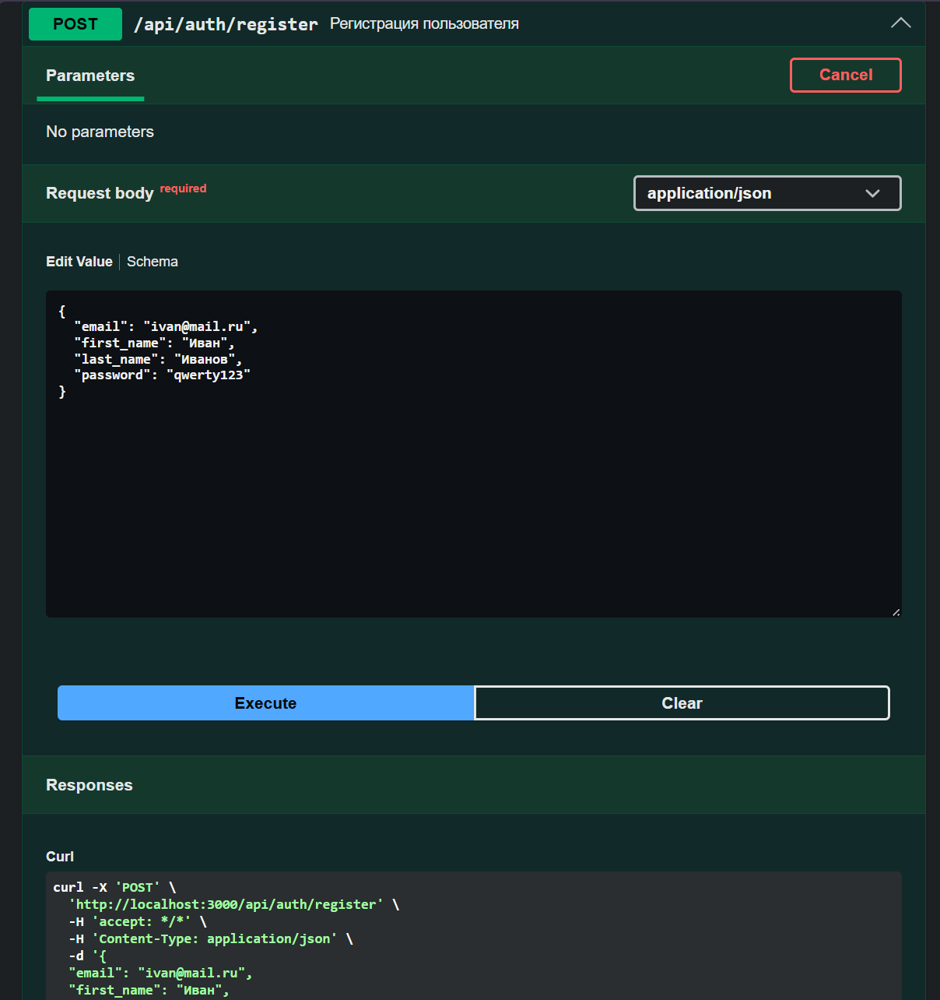
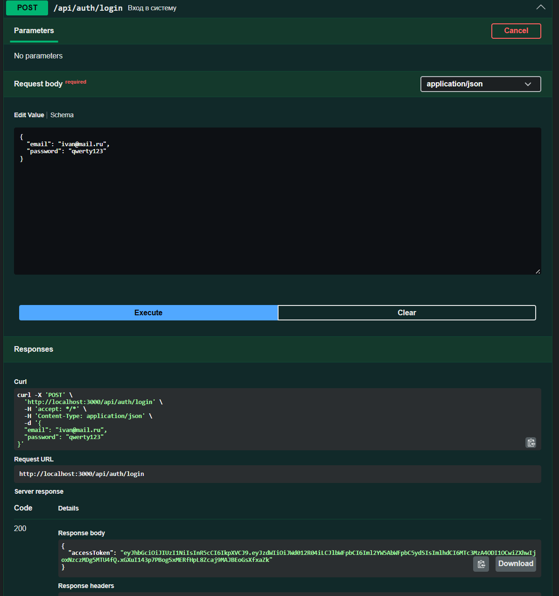
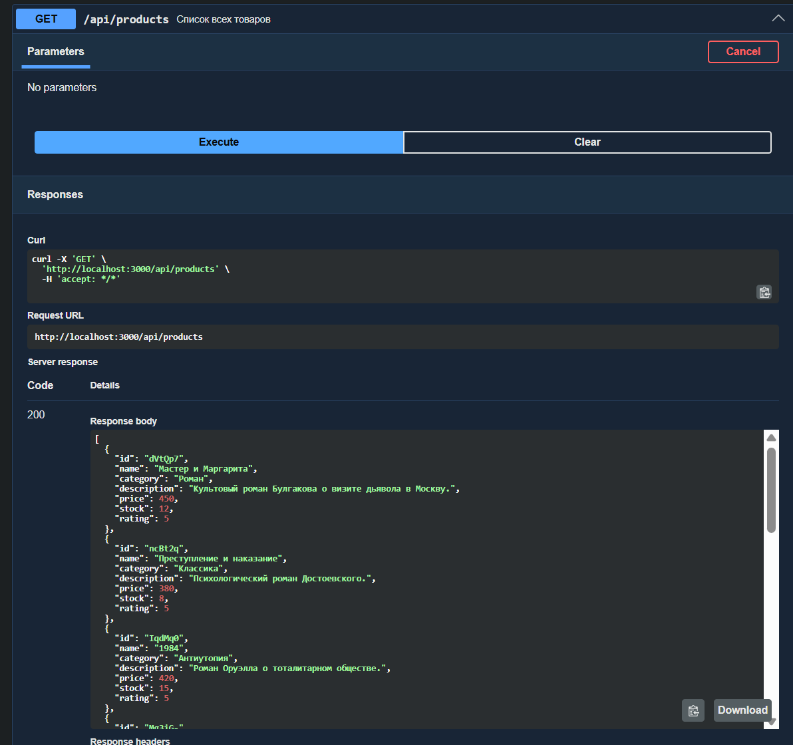
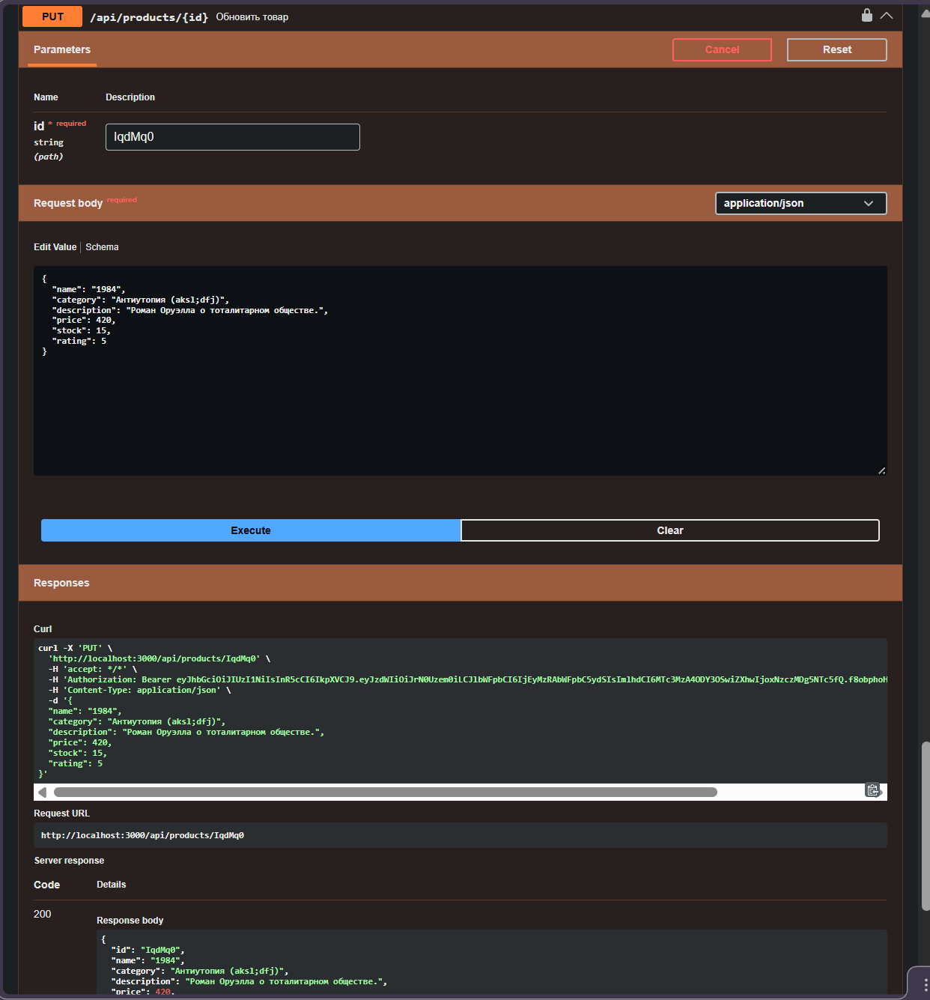
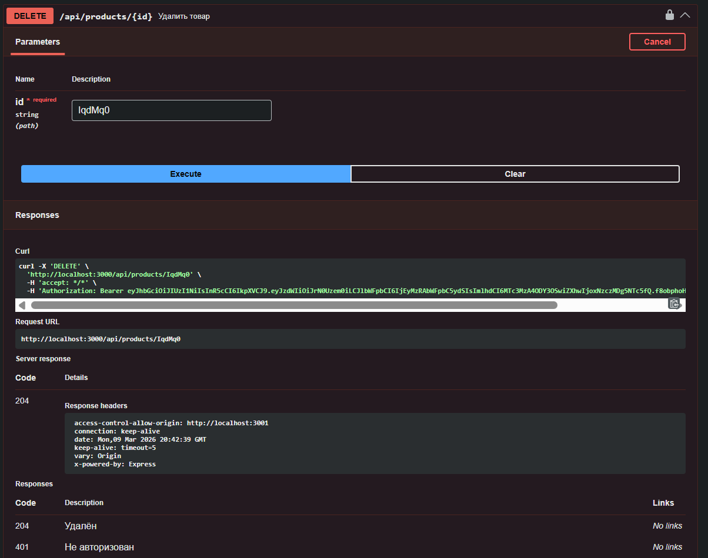

**Практические работы по дисциплине «Фронтенд и бэкенд разработка»**

**Практическая 7. Регистрация, вход и хеширование паролей**

Реализован базовый механизм аутентификации пользователей.
- Разработаны API-эндпоинты для создания учётной записи (`/api/auth/register`) и входа в систему (`/api/auth/login`).
- Пароли пользователей не хранятся в открытом виде: перед записью они преобразуются в хеш при помощи библиотеки `bcrypt` с использованием соли.
- В процессе входа сервер сравнивает хеш введённого пароля с сохранённым, не раскрывая исходное значение.

**Практическая 8. Авторизация на основе JWT**

Внедрена токен-ориентированная система авторизации, не требующая хранения сессий на стороне сервера.
- После успешного входа пользователь получает `access_token` — цифровой пропуск, содержащий его идентификатор и роль.
- Реализовано промежуточное ПО (`authMiddleware`), которое проверяет действительность токена при обращении к защищённым маршрутам.
- Добавлен защищённый маршрут `GET /api/auth/me`, возвращающий данные текущего авторизованного пользователя.

**Практическая 9. Refresh-токены**

Реализован механизм длительной работы без повторной авторизации при сохранении высокого уровня безопасности.
- Система выдаёт два типа токенов: краткосрочный `access_token` (15 минут) и долгоживущий `refresh_token` (7 дней).
- Добавлен эндпоинт `POST /api/auth/refresh`, принимающий refresh-токен и возвращающий новую пару токенов.
- Реализована ротация refresh-токенов: при каждом обновлении старый токен удаляется и выпускается новый, что снижает риск его повторного использования.

**Практическая 10. Хранение токенов на фронтенде и автообновление сессии**

Реализована клиентская часть приложения на React.js с автоматическим управлением токенами.
- Токены хранятся в `localStorage` браузера и автоматически подставляются в заголовок `Authorization` каждого запроса через axios interceptors.
- При получении ошибки `401` от сервера клиент автоматически и незаметно для пользователя запрашивает новую пару токенов через `/api/auth/refresh` и повторяет исходный запрос с новым `access_token`.
- Если refresh-токен также недействителен, пользователь перенаправляется на страницу входа.
- Реализованы страницы входа и регистрации, а также управление товарами: просмотр списка, создание, редактирование и удаление.

**Практическая 11. Ролевая модель доступа (RBAC) и административная панель**

Введена система разграничения прав доступа для разных категорий пользователей.
- Определены 4 роли: `Гость` (не аутентифицирован), `Пользователь` (только просмотр товаров), `Продавец` (создание и редактирование товаров), `Администратор` (полный доступ, включая управление пользователями).
- Добавлена проверка прав на уровне сервера через `roleMiddleware`: пользователь без соответствующей роли получает ошибку `403 Forbidden`.
- На фронтенде кнопки управления товарами отображаются в зависимости от роли пользователя.
- Разработана административная панель, позволяющая просматривать список пользователей, обновлять их данные и блокировать нарушителей.