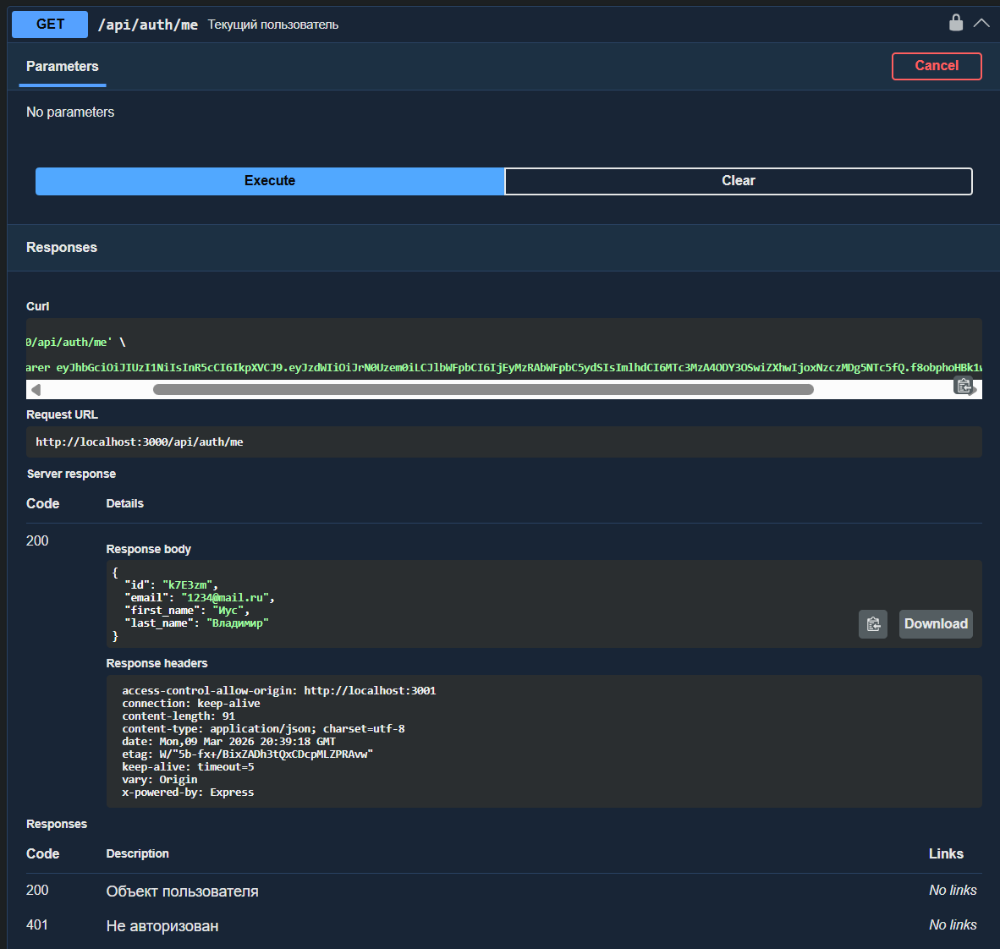
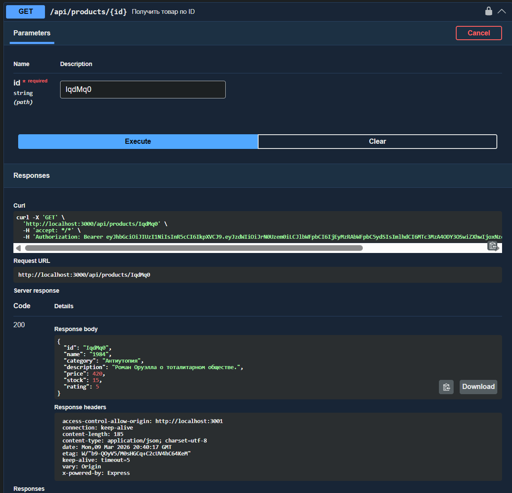

Практические работы по дисциплине «Фронтенд и бэкенд разработка»

**Практическая 7. Регистрация, вход и хеширование паролей**

Реализован базовый механизм аутентификации пользователей.
* Разработаны API-эндпоинты для создания учётной записи (`/register`) и входа в систему (`/login`).
* Пароли пользователей не хранятся в открытом виде: перед записью в базу данных они преобразуются в хеш при помощи библиотеки `bcrypt`.
* В процессе входа сервер сравнивает хеш введённого пароля с сохранённым, не раскрывая исходное значение.

**Практическая 8. Авторизация на основе JWT**

Внедрена токен-ориентированная система авторизации, не требующая хранения сессий на стороне сервера.
* После успешного входа пользователь получает `access_token` — цифровой пропуск, содержащий его идентификатор и роль.
* Реализовано промежуточное ПО (`authMiddleware`), которое проверяет действительность токена при обращении к защищённым маршрутам (например, при добавлении нового товара).

**Практическая 9. Защита токенов через Cookie**

Повышена устойчивость системы к перехвату токенов.
* Токен авторизации передаётся и хранится в `HttpOnly` cookie, что исключает возможность его чтения или кражи через клиентский JavaScript, в том числе при XSS-атаках.

**Практическая 10. Refresh-токены и автоматическое обновление сессии**

Реализован механизм длительной работы без повторной авторизации при сохранении высокого уровня безопасности.
* Система выдаёт два типа токенов: краткосрочный `access_token` и долгоживущий `refresh_token`.
* По истечении срока действия `access_token` клиентская часть приложения автоматически и незаметно для пользователя запрашивает новый токен через эндпоинт `/refresh`, после чего работа продолжается в штатном режиме.

**Практическая 11. Ролевая модель доступа (RBAC) и административная панель**

Введена система разграничения прав доступа для разных категорий пользователей.
* Определены 4 роли: `Гость`, `Пользователь` (только просмотр), `Продавец` (управление товарами), `Администратор` (полный доступ).
* Добавлена проверка прав на уровне сервера: пользователь без соответствующей роли не может удалять товары или получать доступ к административным разделам.
* Разработана административная панель, позволяющая управлять ролями участников и блокировать нарушителей правил платформы.